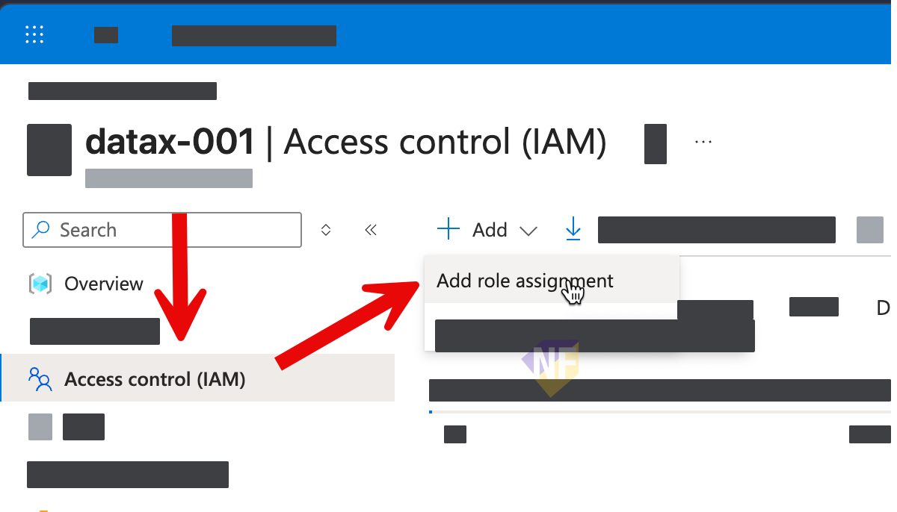
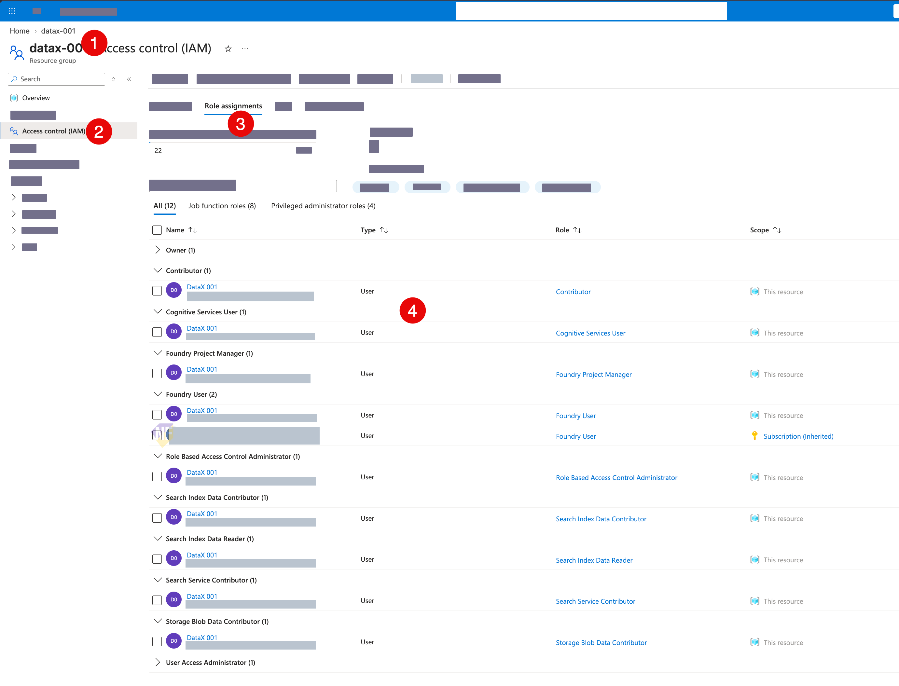
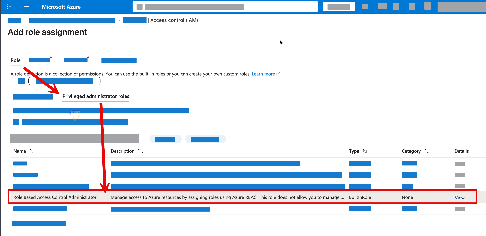

# IT Admin Environment Setup for the Microsoft Foundry Agent Workshop

This guide prepares one isolated Azure and GitHub development environment per learner. Complete it before the workshop and rehearse the complete journey with an ordinary learner account on the actual workshop network.

> **Security boundary:** Give each learner one dedicated Azure resource group. Do not grant learner permissions at subscription scope, and do not reuse one cohort-wide group across every learner resource group.

## 1. Prepare the Azure subscription

> งานส่วนนี้เป็นงานระดับ subscription ของ IT Admin ครับ 

ให้แน่ใจว่า subscription ที่สร้างให้กับผู้เรียนได้ register provider ที่จำเป็นทั้งหมดแล้ว:

| Service | Provider namespace |
|---|---|
| Microsoft Foundry resources, projects, and models | `Microsoft.CognitiveServices` |
| Azure AI Search and Foundry IQ | `Microsoft.Search` |
| Azure Blob Storage | `Microsoft.Storage` |
| Azure Bot Service | `Microsoft.BotService` |

## 2. สร้าง resource group ให้กับผู้เรียนแต่ละคน

> งานส่วนนี้เป็นงานของ IT Admin ครับ 

1. สร้าง resource group ที่ผู้เรียนแต่ละคนจะใช้ 1 resource group ต่อผู้เรียน โดยใช้ naming convention ที่ชัดเจน เช่น `foundry-workshop-learner1-rg` หรือ `foundry-workshop-learner2-rg` เพื่อให้สามารถระบุผู้เรียนได้ง่าย
2. กำหนดเพิ่ม role และ permission ให้กับผู้เรียนแต่ละคนใน resource group ของตนเอง โดยไม่ให้สิทธิ์ในการเข้าถึง resource group ของผู้เรียนคนอื่น

## 3. Assign the 8 roles ให้ account ผู้เรียนกับ resource group ของตนเอง

> งานส่วนนี้เป็นงานของ IT Admin ครับ 

ทำการเพิ่ม role assignments ให้กับผู้เรียนแต่ละคน สำหรับ resource group ของตนเอง โดยใช้ role ตามรายละเอียดที่กำหนดไว้ด้านล่าง

> มีภาพตัวอย่างด้านล่างของตารางเพื่อตรวจเช็คครับ

| Role | Role-definition ID | Workshop purpose |
|---|---|---|
| `Contributor` | `b24988ac-6180-42a0-ab88-20f7382dd24c` | Creates and manages learner-owned Foundry, Search, Storage, model deployment, and Bot resources. It cannot create Azure role assignments. |
| `Foundry Project Manager` | `eadc314b-1a2d-4efa-be10-5d325db5065e` | Creates and manages Foundry projects, agents, workflows, connections, and publishing operations. |
| `Cognitive Services User` | `a97b65f3-24c7-4388-baec-2e87135dc908` | Enables Microsoft Entra-authenticated inference against model endpoints inherited from the learner resource group. It does not replace Foundry roles. |
| `Storage Blob Data Contributor` | `ba92f5b4-2d11-453d-a403-e96b0029c9fe` | Creates containers and uploads, reads, and manages Foundry IQ source documents. |
| `Search Service Contributor` | `7ca78c08-252a-4471-8644-bb5ff32d4ba0` | Creates and manages Search indexes, indexers, knowledge sources, and knowledge bases. |
| `Search Index Data Contributor` | `8ebe5a00-799e-43f5-93ac-243d3dce84a7` | Loads, queries, and validates Search index data. |
| `Search Index Data Reader` | `1407120a-92aa-4202-b7e9-c0e197c71c8f` | Provides explicit read-only Search and knowledge-base retrieval access for the signed-in learner. |
| `Role Based Access Control Administrator` | `f58310d9-a9f6-439a-9e8d-f62e7b41a168` | Temporarily lets the Foundry wizard create required non-privileged managed-identity assignments inside the learner resource group. The mandatory condition is described below. |

> การกำหนด Role Based Access Control Administrator จะมีรายละเอียดเพิ่มเติมด้านล่างครับ

### ภาพตัวอย่างหลังจากทำการ assign role ให้กับผู้เรียนใน resource group ของตัวเอง เรียบร้อยแล้ว

สมมติว่าผู้เรียนมีชื่อว่า **DataX 001** และ resource group ของผู้เรียนคือ **datax-001** หลังจาก assign role ให้กับผู้เรียนเรียบร้อยแล้ว จะได้หน้าตาแบบนี้

### รายละเอียดการกำหนด Role Based Access Control Administrator

นักเรียนจำเป็นต้องมีการกำหนดสิทธิ์ `Role Based Access Control Administrator` เพื่อให้สามารถสร้าง managed identity สำหรับ Foundry IQ ได้ แต่ต้องมีเงื่อนไข (condition) เพื่อจำกัดสิทธิ์ไม่ให้ผู้เรียนสามารถ assign role ที่เป็น privileged ได้

1. เปิด resource group ของผู้เรียนใน Azure portal
2. เลือก **Access control (IAM) > Add > Add role assignment**.
   
3. เปิด **Privileged administrator roles**.
4. เลือก **Role Based Access Control Administrator**.
  
1. เลือก account ผู้เรียน
2. ในส่วนของ **What user can do**, เลือก **Allow user to assign all roles except privileged administrator roles Owner, UAA, RBAC (Recommended)**.
  
1. กด **Next** และตรวจสอบรายละเอียดการ assign role ให้ถูกต้อง
2. กด assign เพื่อทำการ assign role ให้กับผู้เรียน

> **⚠️ Never do this:** ห้ามกำหนด assign role นี้โดยที่ไม่กำหนด condition

## 5. ตรวจสอบว่า network และเครื่องของผู้เรียนสามารถใช้งาน github.com รวมถึงการดาวน์โหลดและอัพโหลดไฟล์ได้

1. ตรวจสอบว่าเครื่องของผู้เรียนสามารถเข้าถึง [GitHub repository ของ workshop](https://github.com/teerasej/data-x-foundry-day-public/) ได้
   
2. ตรวจสอบว่าเครื่องของผู้เรียนสามารถใช้งาน Github Codespaces ได้ 

## 6. Cleanup

1. ลบ resource group ของผู้เรียนแต่ละคนหลังจาก workshop เสร็จสิ้น เพื่อป้องกันค่าใช้จ่ายที่ไม่จำเป็น

## อ้างอิง

- [Azure built-in roles](https://learn.microsoft.com/azure/role-based-access-control/built-in-roles)
- [Role-based access control for Microsoft Foundry](https://learn.microsoft.com/azure/foundry/concepts/rbac-foundry)
- [Configure keyless authentication for Foundry models](https://learn.microsoft.com/azure/foundry/foundry-models/how-to/configure-entra-id)
- [Connect Foundry IQ to Foundry Agent Service](https://learn.microsoft.com/azure/foundry/agents/how-to/foundry-iq-connect)
- [Connect to Azure AI Search using roles](https://learn.microsoft.com/azure/search/search-security-rbac)
- [Sign in with Azure CLI](https://learn.microsoft.com/cli/azure/authenticate-azure-cli-interactively)
- [GitHub Codespaces billing](https://docs.github.com/billing/managing-billing-for-your-products/managing-billing-for-github-codespaces/about-billing-for-github-codespaces)
