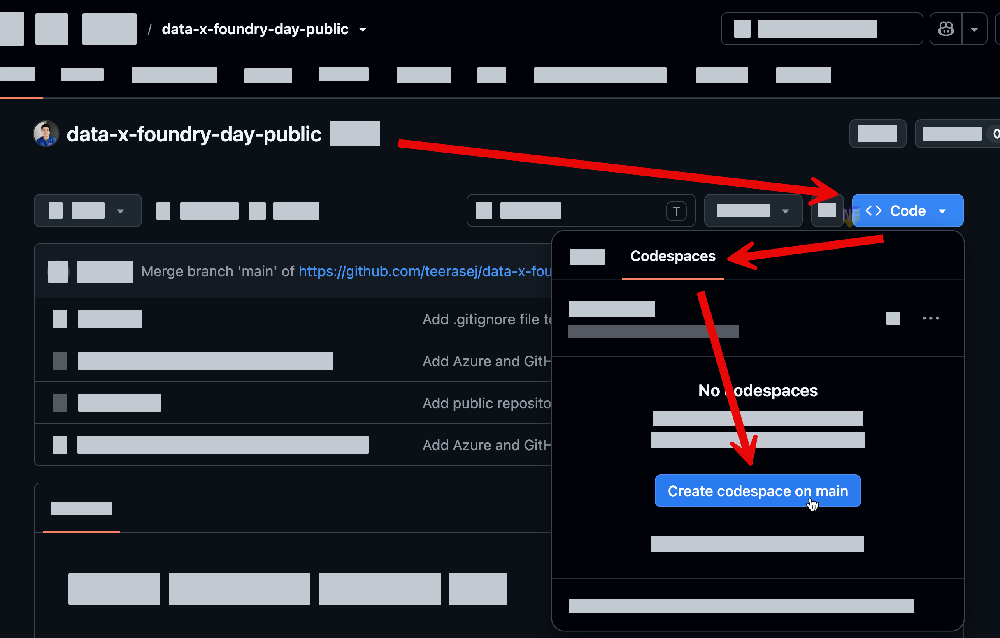
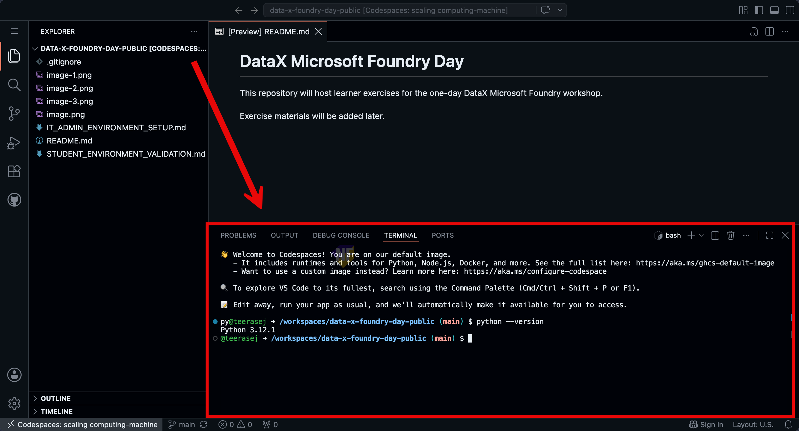
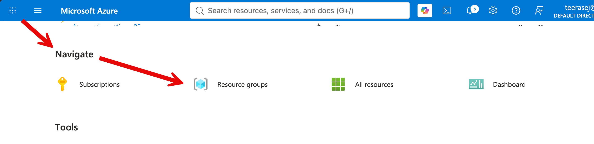
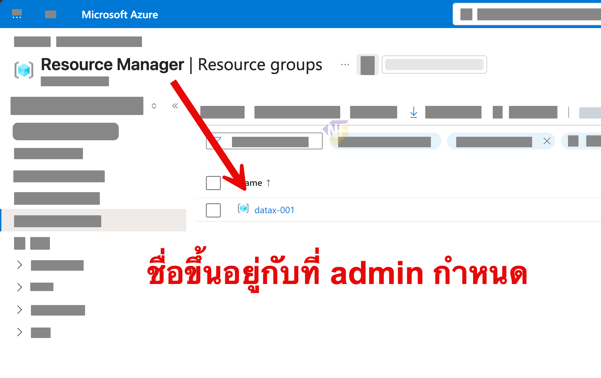
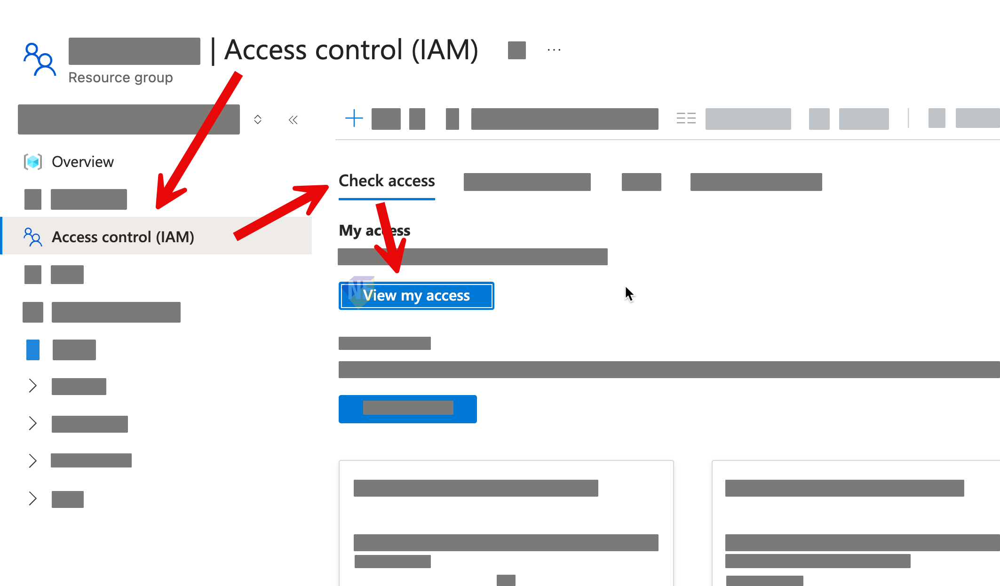

# ตรวจความพร้อมของบัญชีและเครื่องก่อนเริ่ม Workshop

เอกสารนี้ช่วยให้ผู้เรียนตรวจว่า GitHub, Codespaces, Azure account, Resource group และ Microsoft Foundry พร้อมใช้งานก่อนเริ่ม Exercise ให้ลองทำตามลำดับและหยุดแจ้งทีม Support ทันทีเมื่อผลลัพธ์ไม่ตรงกับ Checkpoint

> **License และค่าใช้จ่าย:** GitHub Codespaces มี included usage และค่าใช้จ่ายต่างกันตามประเภทบัญชี ส่วน Azure และ Microsoft Foundry อาจมีค่าใช้จ่ายตามการใช้งาน ให้ใช้เฉพาะบัญชี, Resource group, Region และ Model ที่ผู้จัดอบรมกำหนด


## Practice 1: ตรวจ GitHub account และ Repository

**Primary target:** ยืนยันว่า GitHub account เปิด Workshop repository และเห็นตัวเลือกสร้าง Codespace ได้

1. ให้แน่ใจว่าได้สร้าง [GitHub account เป็นบัญชีส่วนตัว](https://github.com/signup)ที่สามารถเข้าร่วม Workshop ได้
2. เปิด [GitHub repository ของ workshop](https://github.com/teerasej/data-x-foundry-day-public/tree/main)
3. กดปุ่ม **Code** > Tab **Codespaces** > **Create codespace on main** เพื่อสร้าง Codespace ใหม่
   
4. ระบบจะเปิด codespace ใหม่ Web Browser ให้รอสักครู่จน Codespace เปิดและติดตั้ง Dependencies เสร็จ
5. ตรวจว่า codespace สามารถรันคำสั่ง terminal ด้านล่าง เพื่อเช็ค python version ได้ 
   ```bash
   python --version
   ```
   

> **⚠️ Note:** อย่ากดสร้าง Codespace ซ้ำหลายตัว เพราะอาจใช้ Compute และ Storage quota เพิ่ม หากไม่เห็น Tab **Codespaces** ให้หยุดและแจ้งทีม Support พร้อมระบุเพียงว่าบัญชีเป็น Personal, Organization-managed หรือ Enterprise Managed User

---

## Practice 2: ลงชื่อเข้าใช้ Azure และตรวจ Resource group

**Primary target:** ยืนยันว่า Azure account เข้าได้และมองเห็น Resource group ที่ได้รับมอบหมาย

1. เปิด Azure Portal https://portal.azure.com และ Sign in ด้วย Azure account ที่ได้รับจาก IT Admin
2. เลื่อนลงมาที่ส่วน Navigate และกดเปิด Resource groups 
   
3. ดูว่ามี Resource group ที่ admin สร้างเตรียมไว้ให้ปรากฏในรายการหรือไม่ (ชื่อจะเป็นตามที่ IT Admin กำหนด)
   


> **⚠️ Note:** หากไม่เห็น Resource group ให้แจ้งทีม Support ให้จัดเตรียมให้เสร็จก่อนเริ่ม Workshop

## Practice 3: ตรวจ Azure RBAC ทั้งแปดรายการ

**Primary target:** ยืนยันว่า Azure account มี Role ที่ Workshop ต้องใช้ครบใน Resource group ของตน

1. เปิด [Azure portal](https://portal.azure.com) แล้ว Sign in ด้วย Azure account เดียวกับ Azure CLI
2. เปิด **Resource groups** แล้วเลือก Resource group ที่ได้รับมอบหมาย
3. เลือก **Access control (IAM) > View my access**
   
4. ตรวจว่าพบ Assignment ต่อไปนี้ครบแปดรายการที่ Resource group นี้:

   1. `Contributor`
   2. `Foundry Project Manager`
   3. `Cognitive Services User`
   4. `Storage Blob Data Contributor`
   5. `Search Service Contributor`
   6. `Search Index Data Contributor`
   7. `Search Index Data Reader`
   8. `Role Based Access Control Administrator` แบบมี Condition ที่ IT กำหนด

   

5. ตรวจว่า Scope ของ Assignment คือ Resource group ที่ได้รับ ไม่ใช่ Subscription

> **⚠️ Note:** หากไม่พบ Role ตามที่กำหนด ให้แจ้งทีม Support ให้ตรวจสอบและแก้ไขให้เสร็จก่อนเริ่ม Workshop

> `Cognitive Services User` ช่วยให้บัญชีผู้เรียนเรียก Model endpoint ด้วย Microsoft Entra authentication ส่วน `Foundry Project Manager` ใช้สร้างและจัดการ Project, Agent และ Workflow จึงต้องมีทั้งสอง Role

> Role ของผู้เรียนไม่ได้แทน Role ของ Managed identity ตัวอย่างเช่น Agent ที่ทำงานด้วย Managed identity ยังต้องมี `Search Index Data Reader` ของตัวเองเพื่ออ่าน Knowledge base

---

## Practice 5: ตรวจ Microsoft Foundry portal

**Primary target:** ยืนยันว่า Azure account เปิด Microsoft Foundry และเลือก Environment ที่ได้รับได้โดยไม่สร้าง Resource ผิด Scope

1. เปิด [Microsoft Foundry](https://ai.azure.com) แล้ว Sign in ด้วย Azure account เดียวกับ Practice 3
2. ทดสอบสร้าง Project ใหม่ โดยเลือก Subscription, Resource group และ Region อย่าง West US 3 หรือ East US 2 ได้

> **⚠️ Note:** หากไม่สามารถสร้าง Project ได้ หรือสร้างแล้วติดปัญหา ให้แจ้งทีม Support ให้ตรวจสอบและแก้ไขให้เสร็จก่อนเริ่ม Workshop

## Summary

เราได้ตรวจ GitHub, Codespaces, Azure CLI, Azure RBAC, Resource group และ Microsoft Foundry แล้ว ขั้นต่อไปให้กลับไปที่ [Workshop README](./README.md) และเริ่ม Exercise 1 ตามคำแนะนำของผู้สอน
