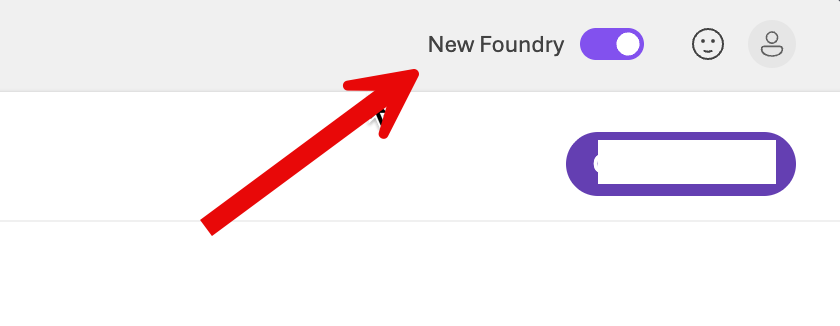
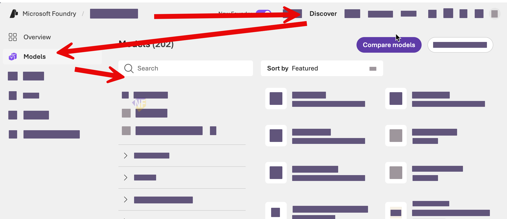
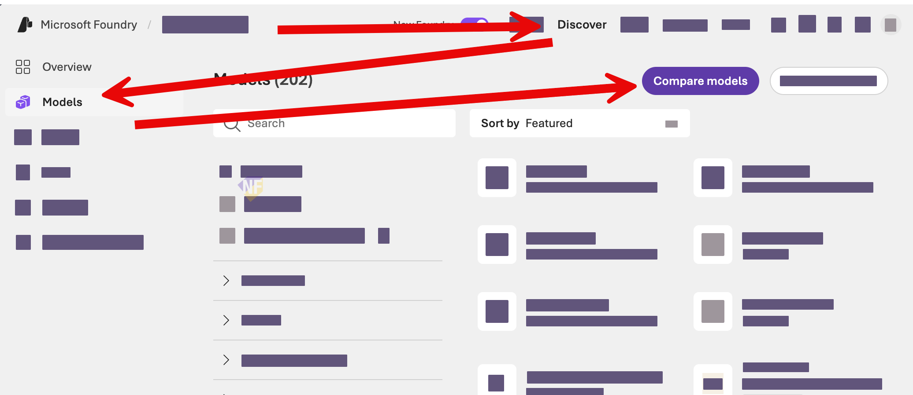
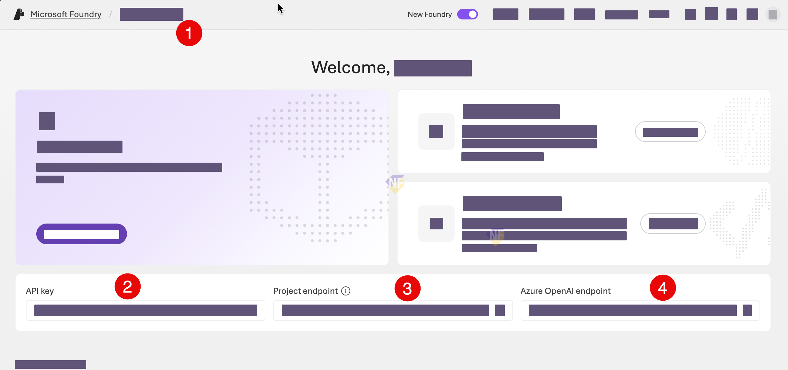
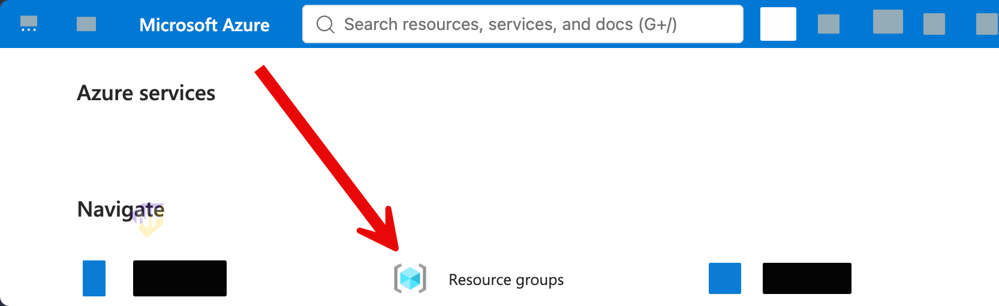

# Exercise 1: เตรียม Microsoft Foundry project

เราจะเตรียมพื้นที่ทำงานเดียวสำหรับ Fabrikam Service Operations Agent และใช้ project กับ model deployment นี้ต่อเนื่องตลอดเวิร์กช็อป

> **License และค่าใช้จ่าย:** เนื้อหาต้นฉบับเป็นลิขสิทธิ์ของ Amaround Co., Ltd. แบบ All rights reserved และมีส่วนที่ดัดแปลงจาก MicrosoftLearning ภายใต้ MIT License ตาม [THIRD_PARTY_NOTICES.md](../../THIRD_PARTY_NOTICES.md) การใช้ Microsoft Foundry และ GitHub Codespaces อาจมีค่าใช้จ่ายหรือ included usage จำกัด ต้องตรวจสอบสิทธิ์ก่อนเริ่มอบรม

## Prerequisites

- Codespace เปิดสำเร็จและ bootstrap ทำงานจบ
- Azure account และชื่อ resource group ที่ IT Admin มอบหมายให้
- ชื่อ region และ model ที่ผู้สอนยืนยันว่าใช้ได้
- สิทธิ์สร้าง project/model deployment หรือ IT-prepared fallback

> **⚠️ Note:** ใช้เฉพาะ resource group ที่ได้รับมอบหมาย ห้ามสร้าง resource group ใหม่หรือย้ายไปใช้ resource group ของผู้เรียนคนอื่น

---

## Practice 1: ยืนยันเครื่องมือและขอบเขต Azure

**Primary target:** ตรวจความพร้อมของ Codespace และยืนยันว่า Azure account เข้าถึง resource group ที่ได้รับมอบหมายได้

1. เปิด **Terminal** ใน Codespace แล้วรัน:

   ```bash
   python -m service_ops check
   ```

2. ตรวจว่า `Python`, `Repository virtual environment`, `Git`, `Azure CLI` และ Python imports แสดง `READY`

3. ลงชื่อเข้าใช้ Azure ด้วย device code:

   ```bash
   az login --use-device-code
   ```

4. ทำตาม URL และรหัสที่ Terminal แสดง โดยใช้บัญชีที่ IT Admin แจ้งไว้

5. ตรวจชื่อ account โดยไม่แสดง tenant หรือ subscription ID:

   ```bash
   az account show --query "{account:name,user:user.name}" --output table
  
   ```

6. แสดงรายการ resource group ที่บัญชีผู้เรียนเข้าถึงได้:

   ```bash
   az group list --query "[].{name:name,location:location}" --output table
   ```

7. จดชื่อ project ที่จะใช้ตามรูปแบบ `foundry-serviceops-<resource-group-suffix>` เช่น `foundry-serviceops-001` 

### Checkpoint

- คำสั่ง `python -m service_ops check` แสดงรายการเครื่องมือพื้นฐานที่จะใช้ในการอบรม (base tools) เป็น `READY`
- `az group list` แสดงรายการ resource group ที่บัญชีผู้เรียนเข้าถึงได้ และพบ resource group ที่ IT Admin มอบหมาย

> **💡 Tip:** ถ้า `az login` สำเร็จแต่ portal ยังไม่เห็นสิทธิ์ ให้รอสักครู่แล้ว sign out/sign in ใหม่ การกระจาย RBAC อาจใช้เวลา

---

## Practice 2: สร้าง project และทดสอบ model deployment

**Primary target:** สร้างหรือเลือก Microsoft Foundry project ใน resource group ที่กำหนด แล้วทดสอบ approved model ใน playground ได้

1. เปิด [Microsoft Foundry portal](https://ai.azure.com) แล้ว sign in ด้วยบัญชีเดียวกับ Azure CLI

2. ตรวจว่ามีการเปิดใช้โหมด **New Foundry** ตามที่ผู้สอนสาธิต แล้วเลือก **Start building**
   

3. เลือกสร้าง project ใหม่ แล้วกรอกชื่อจาก Practice 1

4. เปิด **Advanced options** และตรวจค่าก่อนเลือก **Create**:

   - **Subscription:** subscription ที่ IT Admin ระบุ
   - **Resource group:** เลือก resource group ที่เป็นของตัวเองเท่านั้น
   - **Region:** region ที่สามารถเลือกได้ เช่น **East US 2**, หรือ region ที่ IT Admin ยืนยันว่าใช้ได้
   - **Foundry resource:** ใช้ชื่อที่กำหนดให้หรือค่าที่ IT Admin เตรียมไว้

5. รอจน project สร้างเสร็จ แล้วเปิด project home page เพื่อตรวจ **Project endpoint** และ **Models**
6. เปิด **Discover > Models** แล้วลองสำรวจ model gpt-5.5  หรือที่สามารถเลือกได้
   

7. กลับมาที่ Discover > Models และให้กดเปิด Compare model
    แล้วเปรียบเทียบอย่างน้อยสองรายการต่อไปนี้กับ model อีก 2 ตัวที่สนใจในตาราง:
   
   - Input/output modality
   - Context window
   - Supported region หรือ deployment type
   - Limitation หรือ use case ที่ระบุใน model card

8. เลือก model **gpt-4o** และกด **Deploy** > **Custom Setting** และกำหนดค่าต่อไปนี้:

   - Deployment name: 
   ```
   gpt-4o
   ```
   - Deployment type: 
   ```
   Global Standard
   ```
   - Token limit: 
   ```
   500,000-1,000,000
   ```
   - Guardrails: 
   ```
   DefaultV2
   ```

9. กด **Deploy** แล้วรอจน deployment สร้างเสร็จ จากนั้นตรวจชื่อ deployment ใน Models

10.  เปิด model playground แล้วใส่ **Instructions**:

   ```text
   You are a careful service-operations assistant. Use only the information supplied in the conversation. State clearly when information is missing.
   ```

11.  ส่ง prompt ต่อไปนี้:

   ```text
   A service desk wants to reduce response time without hiding unresolved incidents. Suggest three measurable checks and explain why each matters.
   ```

12.  ตรวจว่าคำตอบเสนอ measurable checks และไม่อ้างข้อมูลจริงขององค์กร Fabrikam ที่ยังไม่ได้ให้

### ตรวจสอบ project และ model deployment

1. จากเมนูด้านบนของ Foundry portal ให้เลือก **Home** เพื่อกลับมาหน้าแรก และสังเกต:
   1. ชื่อ project 
   2. API key
   3. Project endpoint
   4. Azure OpenAI Endpoint
   
2. Login เข้า https://portal.azure.com/ ด้วยบัญชีเดียวกับ Foundry portal แล้วกดเปิด resource group ที่สร้าง project ว่าอยู่ในรายการ **Resource groups** ของ Azure portal
   

### Checkpoint

- Project อยู่ใน resource group ที่ได้รับมอบหมาย
- Approved model deployment เปิดใน playground และตอบ test prompt ได้
- ผู้เรียนอธิบายความต่างจาก model ทางเลือกได้อย่างน้อยสองข้อจาก model cards

> **⚠️ Note:** ถ้า quota หรือสิทธิ์ไม่อนุญาตให้ deploy ห้ามลอง region หรือ resource group ให้ตรวจสอบกับฝ่าย IT Admin ก่อนเปลี่ยนค่าใด ๆ 
> 
> การ deploy model ต้องใช้ role ที่กำหนดให้ account ผู้เรียนอย่าง Foundry Project Manager และ Cognitive Services User role ของ resource group ที่ฝ่าย IT Admin สร้างให้

---

## Practice 3: เชื่อม Codespace กับ Foundry project

**Primary target:** บันทึก project endpoint และ model deployment ใน `.env` แล้วตรวจการเชื่อมต่อพื้นฐานจาก Codespace ได้

1. ใน Microsoft Foundry portal เปิด project home page แล้วคัดลอก **Project endpoint**

2. กลับมาที่ Codespace แล้วสร้าง `.env` จากไฟล์ตัวอย่าง:

   ```bash
   cp .env.example .env
   ```

3. เปิดไฟล์ `.env` แล้วแทนค่าต่อไปนี้:

   ```dotenv
   FOUNDRY_PROJECT_ENDPOINT=<project-endpoint>
   FOUNDRY_MODEL=<model-deployment-name>
   FOUNDRY_AGENT_NAME=fabrikam-service-operations-agent
   ```

4. บันทึกไฟล์ แล้วตรวจว่า Git จะไม่มีการ track ไฟล์ `.env` โดยจะไม่มีการแสดงชื่อไฟล์ `.env` ในผลลัพธ์ของคำสั่ง:

   ```bash
   git status --short
   ```

5. เปิด **Foundry Toolkit** ใน VS Code แล้วเลือก **Microsoft Foundry Resources > Set Default Project**

6. เลือก project เดียวกับที่สร้างใน Practice 2 แล้วเปิด **Models** เพื่อตรวจชื่อ deployment

7. ถ้า Foundry Toolkit ไม่แสดงผล ให้ใช้ portal ทดแทน โดยให้แน่ใจว่าการกำหนดค่าของ project endpoint และ deployment ตรงกับที่อยู่บน project home page

8. รันคำสั่ง check:

   ```bash
   python -m service_ops check --strict
   ```
   จะเห็นข้อความสุดท้ายว่า
   
   ```   
   READY  .env configuration: project endpoint and model are set
   ```

### Checkpoint

- ไฟล์`.env` มี project endpoint และ model deployment โดยไม่มี key หรือ credential
- `python -m service_ops check --strict` สามารถรันผ่านได้โดยไม่มี `ERROR` หรือ `ACTION`
- พบ model deployment ใน Foundry Toolkit หรือยืนยันผ่าน portal fallback

---

## Summary

เราเตรียม Codespace, ยืนยัน Azure boundary, สร้างหรือเลือก Foundry project, เปรียบเทียบและทดสอบ approved model แล้ว ขั้นต่อไปจะเพิ่ม portal-managed agent และ code-owned Agent Framework agent ใน project เดิม

> **⚠️ Note:** ยังไม่ต้องลบ project, model deployment หรือ resource group เพราะ Exercise ถัดไปจะใช้งานต่อ
