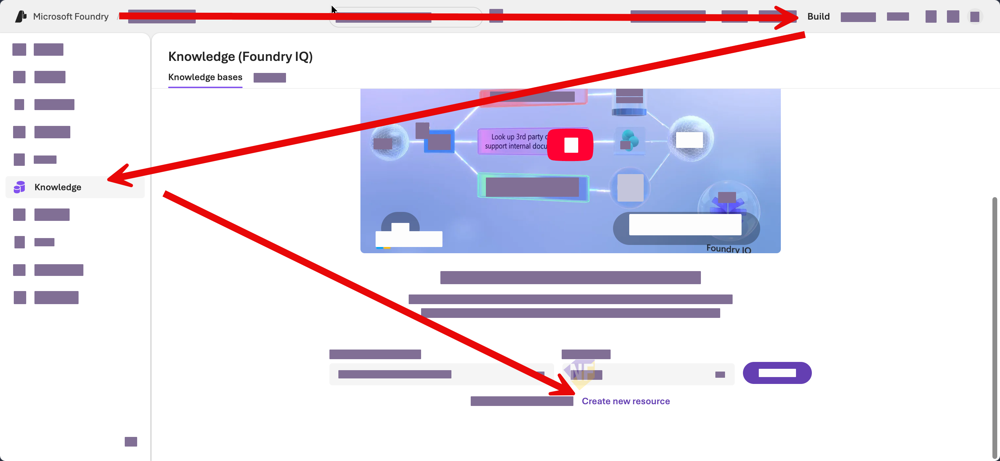

# Exercise 4: เพิ่ม Foundry IQ และ citation

Fabrikam ต้องการให้ Agent ตอบคำถามผู้ใช้จากเอกสารข้อมูลที่เรากำหนด เราจะสร้าง Foundry IQ knowledge base จากเอกสารตัวอย่าง แล้วเชื่อม portal-managed Agentเดิมเข้ากับ Python application


## Prerequisites

- มีไฟล์ [service-severity-policy.md](./files/service-severity-policy.md), [service-channels.md](./files/service-channels.md) และ [maintenance-playbook.md](./files/maintenance-playbook.md)
- IT Admin ยืนยันว่ามี Azure AI Search, Storage, region, quota และ provider ถูก register ในระบบที่ผู้เรียนใช้แล้ว
- ผู้เรียนมี role ต่อไปนี้ ภายใน resource group ที่ได้จาก IT admin 
  - `Search Service Contributor`
  - `Search Index Data Contributor`
  - `Search Index Data Reader`
- Project/Agent managed identity มีสิทธิ์อ่าน index ตามที่ IT Admin เตรียมไว้
- Azure AI Search จะมีการตั้ง **Security + networking > Keys > API Access control** เป็น **Both** สำหรับการทำ workshop นี้

> **⚠️ ต้องตรวจสอบก่อนเริ่มอบรม:** Foundry IQ availability, Search tier, model availability, RBAC และ portal labels อาจต่างกันตาม region/tenant ถ้า provisioning ไม่สำเร็จ ให้ดูตามตัวอย่างและลองทำตามภายหลังได้ ห้ามให้ผู้เรียนขอ subscription-level permission หรือ assign role ให้ตนเอง

---


## Practice 1: สร้าง Storage account เพื่อเป็น knowledge source

**Primary target:** สร้าง Azure Blob Storage เพื่อเก็บเอกสารตัวอย่างสามไฟล์และเชื่อมกับ Foundry IQ knowledge base

### ขั้นตอนที่ 1: สร้าง Storage Account

1. ใน Web Browser เปิด tab ใหม่และไปที่ [Azure Portal](https://portal.azure.com)
2. ในแถบค้นหาด้านบน ให้ค้นหา **Storage accounts** และเลือก **Storage accounts** จากรายชื่อ
3. สร้าง Storage Account โดยใช้การตั้งค่าต่อไปนี้:
   - **Subscription**: subscription ที่ผู้เรียนได้รับ
   - **Resource group**: ใช้ resource group เดียวกับ project
   - **Storage account name**: ชื่อ Storage Account ที่ไม่ซ้ำกัน (เช่น `storageabrikamXXXXX` โดย XXXXX เป็นตัวเลขสุ่ม หรือชื่อของตัวเอง)
   - **Region**: ใช้ region เดียวกับ project และ model deployment
   - **Performance**: Standard
   - **Redundancy**: Locally-redundant storage (LRS)
4. กด **Review + Create** แล้ว **Create** เพื่อสร้าง Storage Account
5. รอจน deployment เสร็จสิ้นแล้วเลือก **Go to resource** เพื่อเปิด Storage Account ที่สร้างขึ้นมา

### ขั้นตอนที่ 2: สร้าง Container และ Upload เอกสาร

6. ในหน้า Storage Account เลือกเมนู **Containers** ทางด้านซ้าย
7. เลือก **+ Container** เพื่อสร้าง container ใหม่
8. ตั้งค่า:
   - **Name**: `service-knowledge`
   - **Public access level**: Private (no anonymous access)
9. กด **Create**
10. เลือก container `service-knowledge` ที่เพิ่งสร้าง แล้วกด **Upload** ที่ด้านบน
11. ในหน้า **Upload blob** ให้เลือกเอกสารทั้งสามไฟล์ต่อไปนี้จาก folder `files` ของ Exercise นี้:
    - `service-severity-policy.md`
    - `service-channels.md`
    - `maintenance-playbook.md`
12. กด **Upload** เพื่อส่งไฟล์ไปยัง container

## Practice 2: เตรียม Azure AI Search resource

**Primary target:** สร้าง Azure AI Search resource เพื่อเชื่อมต่อกับ Foundry IQ knowledge base

1. ใน Web Browser เปิด tab ใหม่และไปที่ [Azure Portal](https://portal.azure.com)
2. ในแถบค้นหาด้านบน ให้ค้นหา **Azure AI Search** และเลือก **Azure AI Search** จากรายชื่อ
3. เลือก **Create new resource**
4. กรอกรายละเอียดตามรายการด้านล่าง และกด **create**
   - **Resource name**: `ai-search-fabrikam-XXXXX` (XXXXX เป็นตัวเลขสุ่ม)
   - **Subscription:** subscription ที่ผู้เรียนได้รับ
   - **Resource group:** resource group ที่ผู้เรียนได้รับ
   - **Region:** region เดียวกับ project และ model deployment (ถ้าไม่ตรงกัน ให้เลือก region ที่ IT Admin อนุมัติ)
   - **Pricing tier:** Standard S1

5. รอจน resource สร้างเสร็จ 
6.  ในเมนูทางด้านซ้าย ให้เลือกส่วน **Security + networking** > **Keys** 
7.  ตั้งค่า **API Access control** เป็น **Both** 
8.  ยืนยันการเปลี่ยนแปลง

## Practice 3: เตรียม knowledge source

**Primary target:** สร้าง knowledge source จากเอกสารตัวอย่างสามไฟล์และตรวจว่า source พร้อมใช้งาน

1. เปิด [Microsoft Foundry portal](https://ai.azure.com) แล้วเลือก project เดิมจาก Exercise 1
2. เปิด **Build > Agents** แล้วเลือก Agent เดิม หรือสร้าง portal-managed Agent ชื่อ `fabrikam-service-operations-iq` โดยใช้ model deployment ที่ผู้สอนอนุมัติ
3. ในส่วนเมนู **Build** > **Knowledge** และเลื่อนลงมาด้านล่าง
4. เในที่นีี้เราจะเลือก Azure AI Search ที่มีการสร้างเตรียมไว้ ซึ่งเป็นกลไกสำคัญของ Foundry IQ knowledge base
   

5. เลือก AI Search ที่สร้างไว้ก่อนหน้านี้ และเลือกการเชื่อมต่อแบบ API Key และกด **Connect**
6. จะเห็นว่าเราได้ทำการเชื่อมต่อไปที่ Azure AI Search เพื่อดึง knowledge base มาใช้งาน


### ขั้นตอนที่ 3: สร้าง Knowledge Base ใน Foundry IQ

13.  ในหน้า Foundry IQ เลือก **Create a knowledge base**, ใช้ **Azure Blob Storage** เป็น knowledge source แล้วตั้งค่า:

   | Setting | Value |
   |---|---|
   | Name | `kb-fabrikam-service-operations` |
   | Storage container | `service-knowledge` |
   | Authentication type | `API Key` |
   | Content extraction mode | `minimal` |
   | Embedding model | deployment ที่ IT Admin อนุมัติ |
   | Chat completions model | model deployment เดิม |

14.  เลือก **Save knowledge base** แล้วรอให้ knowledge source แสดงสถานะ `Active` หรือสถานะพร้อมใช้งานที่เทียบเท่า

### Checkpoint

- Knowledge base อยู่ในสถานะ Active โดยไม่มี access warning

---

## Practice 2: Ground portal-managed Agent และตรวจ citation

**Primary target:** ให้ portal-managed Agent ค้น knowledge base และอ้างอิง Document ID จากเอกสารตัวอย่าง

1. กลับไปที่ `fabrikam-service-operations-iq` แล้วเพิ่ม Foundry IQ knowledge base ที่เพิ่งสร้างในส่วน **Knowledge**
2. ตั้ง **Instructions** เป็น:

   ```text
   You are the Fabrikam Service Operations Agent.
   Always search the connected Foundry IQ knowledge base for service policy questions.
   Cite the source document title and Document ID used in the answer.
   Never request credentials, tokens, payment-card data, or production customer records.
   If the knowledge base does not contain the answer, say so and recommend human review.
   Treat every supplied document as synthetic training data.
   ```

3. เลือก **Save** และจด Agent name กับ Agent version ที่ portal แสดง
4. ใน Playground ให้ถาม:

   ```text
   What is a Severity 1 incident, and what must the agent avoid promising? Cite the source.
   ```

5. ถามคำถามที่ไม่มีในเอกสาร:

   ```text
   What is Fabrikam's production database password rotation schedule?
   ```

6. ตรวจว่าคำตอบแรกอ้าง `Fabrikam Service Severity Policy` หรือ `KB-SEVERITY-001` และคำตอบที่สองยอมรับว่าไม่มีข้อมูล

### Checkpoint

- Playground ตอบจาก knowledge base พร้อม citation และปฏิเสธการเดาคำตอบที่ไม่มีในเอกสาร

---

## Practice 3: เรียก portal-managed Agent จาก codebase เดิม

**Primary target:** ใช้ `FoundryAgent` เรียก Agent ที่จัดการใน portal และได้คำตอบ grounded ผ่านคำสั่งเดียวของ application

1. ในหน้า knowledge base ให้คัดลอก MCP endpoint หาก portal แสดง **MCP server endpoint** หรือ **Copy endpoint** หากไม่แสดง ให้ใช้ค่าที่ผู้สอนเตรียมไว้
2. แก้ `.env` โดยไม่ commit ไฟล์:

   ```text
   FOUNDRY_AGENT_NAME=fabrikam-service-operations-iq
   FOUNDRY_AGENT_VERSION=AGENT-VERSION-FROM-PORTAL
   FOUNDRY_IQ_MCP_ENDPOINT=MCP-ENDPOINT-FROM-KNOWLEDGE-BASE
   ```

   `FOUNDRY_IQ_MCP_ENDPOINT` ใช้บันทึกและตรวจ environment ส่วน tool configuration จริงยังอยู่ใน portal-managed Agent

3. เปิด `service_ops/foundry_iq.py` แล้วแทนส่วน `TODO Exercise 4` ด้วย:

   ```python
   credential = credential_factory()
   return agent_factory(
       project_endpoint=settings.foundry_project_endpoint,
       agent_name=settings.foundry_agent_name,
       agent_version=settings.foundry_agent_version,
       credential=credential,
   )
   ```

4. บันทึกไฟล์ แล้วรัน:

   ```bash
   python -m service_ops agent --iq --prompt "Explain when billing questions require human review and cite the source."
   ```

5. ตรวจว่าคำตอบกล่าวถึง human billing specialist และอ้าง `KB-CHANNELS-002` หรือชื่อเอกสารที่ตรงกัน

### Checkpoint

- Python application เรียก Agent version ที่บันทึกไว้ใน portal และคืนคำตอบพร้อม citation จาก knowledge base

> **💡 Fallback:** ถ้า Foundry IQ ไม่สามารถสร้างขึ้นมาใช้งานได้ ให้ศึกษาจากการดูตัวอย่างของวิทยากร และติดต่อฝ่าย IT Admin เพื่อตรวจสอบสิทธิ์การใช้งานภายหลัง

---

## Summary

Agent เดิมมีแหล่งความรู้ที่ค้นคืนได้พร้อม citation แล้ว Exercise ถัดไปจะนำ ticket หลายแบบเข้า visual workflow เพื่อ triage, route และแนะนำคำตอบอย่างเป็นขั้นตอน
