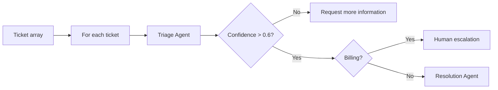

# Exercise 5: สร้าง visual Foundry workflow

Fabrikam ต้องการกระบวนการ triage ที่มองเห็นลำดับงานชัดเจน เราจะสร้าง visual workflow เพื่อจำแนก ticket, ขอข้อมูลเพิ่มเมื่อ confidence ต่ำ, ส่ง Billing ให้คนตรวจ และร่างคำตอบสำหรับกรณีอื่น

> **License:** Original workshop content © 2026 Amaround Co., Ltd. All rights reserved. Third-party notices are recorded in [THIRD_PARTY_NOTICES.md](../../THIRD_PARTY_NOTICES.md).

ใช้เวลาประมาณ **45 นาที** และใช้ Foundry project กับ model deployment เดิม

> **⚠️ Retirement notice:** Foundry workflows เป็น Preview และ Microsoft ประกาศยุติบริการวันที่ **1 ธันวาคม 2026** งาน production ใหม่ควรใช้ Microsoft Agent Framework ดู [official workflow and migration guidance](https://learn.microsoft.com/azure/foundry/agents/concepts/workflow) ชุด workshop นี้ยังสอน visual workflow เพื่อเข้าใจแนวคิดก่อนวันยุติบริการ และมี local fallback ใน Practice 3

## Prerequisites

- ผู้สอนยืนยันว่า **Build > Agents > Workflows** เปิดให้ tenant และ ordinary learner account ใช้งานได้
- มีไฟล์ [service-tickets.json](./files/service-tickets.json)
- ผู้เรียนใช้ project เดิมและไม่สร้าง resource group หรือ model deployment ใหม่
- ถ้า visual designer ไม่พร้อม ให้รัน local fallback แล้วศึกษาลำดับ node จาก diagram



---

## Practice 1: สร้าง ticket loop และ Triage Agent

**Primary target:** สร้าง visual workflow ที่วนประมวลผล ticket สามรายการและคืน category กับ confidence แบบมีโครงสร้าง

1. เปิด [Microsoft Foundry portal](https://ai.azure.com) แล้วเลือก project เดิม
2. เปิด **Build > Agents > Workflows** แล้วเลือก **Create > Blank workflow**
3. เลือก **Save**, ตั้งชื่อ `fabrikam-service-ticket-triage` แล้วเลือก **Save** อีกครั้ง
4. เพิ่ม node **Data transformation > Set variable**, สร้าง `Local.SupportTickets` และใส่ค่า:

   ```text
   [
     "SR-1001: The Invoice API returns a 403 error when our training client creates an invoice.",
     "SR-1002: I was charged twice for the same synthetic invoice and need a review.",
     "SR-1003: Dashboard help"
   ]
   ```

5. เพิ่ม **Flow > For each** ใต้ Set variable:
   - **Select the items to loop for each**: `Local.SupportTickets`
   - **Loop Value Variable**: สร้าง `Local.CurrentTicket`
6. ภายใน For each เพิ่ม **Invoke > Agent**, สร้าง Agent ชื่อ `Fabrikam-Triage-Agent`
7. เปิด **Parameters > Text format > JSON Schema** แล้วใส่:

   ```json
   {
     "name": "triage_response",
     "schema": {
       "type": "object",
       "properties": {
         "ticket_id": {"type": "string"},
         "category": {"type": "string", "enum": ["Billing", "Technical", "General"]},
         "confidence": {"type": "number"}
       },
       "required": ["ticket_id", "category", "confidence"],
       "additionalProperties": false
     },
     "strict": true
   }
   ```

8. ตั้ง **Instructions** ของ Triage Agent:

   ```text
   Classify each synthetic Fabrikam service ticket as exactly Billing, Technical, or General.
   Return its ticket ID and a confidence from 0 to 1.
   Billing means an incorrect charge, refund, or payment.
   Technical means an API error, timeout, integration, or system failure.
   General means a how-to, navigation, report, or unclear request.
   A short request with missing context must have confidence 0.6 or lower.
   Return only the configured JSON response.
   ```

9. ใน **Node settings** ตั้ง **Input message** เป็น `Local.CurrentTicket` แล้วบันทึก output:
   - message เป็น `Local.TriageOutputText`
   - JSON object เป็น `Local.TriageOutputJson`
10. เลือก **Done** แล้ว **Save** workflow

### Checkpoint

- Workflow มี Set variable → For each → Triage Agent และ Triage Agent บันทึก structured output ลง `Local.TriageOutputJson`

---

## Practice 2: เพิ่ม confidence gate และ routing

**Primary target:** สร้าง branch ที่แยก low-confidence, Billing และ automated-response route พร้อมผลลัพธ์ที่มองเห็นได้

1. ใต้ Triage Agent เพิ่ม **Flow > If/Else** และตั้ง condition:

   ```text
   Local.TriageOutputJson.confidence > 0.6
   ```

2. ใน **Else** เพิ่ม **Basics > Deliver a message**:

   ```text
   Request more information for {Local.CurrentTicket}. Ask for the affected service and exact symptom.
   ```

3. ใน **If** เพิ่ม **Flow > If/Else** อีก node และตั้ง condition:

   ```text
   Local.TriageOutputJson.category = "Billing"
   ```

4. ใน Billing branch เพิ่ม **Deliver a message**:

   ```text
   Route {Local.CurrentTicket} to human billing review. Do not promise a refund.
   ```

5. ใน branch ที่ไม่ใช่ Billing เพิ่ม **Invoke > Agent**, สร้าง `Fabrikam-Resolution-Agent` และตั้ง Instructions:

   ```text
   Draft one concise and safe response for a synthetic service ticket.
   For Technical, suggest one or two high-level troubleshooting checks.
   For General, explain the next information or navigation step.
   Never request credentials or production customer data.
   Do not claim that an external action was completed.
   Return only the recommended response.
   ```

6. ตั้ง input เป็น `Local.TriageOutputText` และบันทึก message เป็น `Local.ResolutionOutputText`
7. เลือก **Done** แล้ว **Save**

### Checkpoint

- Diagram มีครบสาม route: ขอข้อมูลเพิ่ม, human billing review และ Resolution Agent

---

## Practice 3: Preview, เรียก workflow และตรวจ fallback

**Primary target:** รัน workflow กับ ticket ทั้งสามจาก portal หรือ code และเปรียบเทียบกับ Agent Framework-ready local fallback

1. เลือก **Preview** แล้วส่ง:

   ```text
   Start processing the synthetic service tickets.
   ```

2. ตรวจผลลัพธ์ที่คาดไว้:
   - `SR-1001` ไป Technical และได้ recommended response
   - `SR-1002` ไป human billing review
   - `SR-1003` ขอข้อมูลเพิ่มเพราะ confidence ต่ำ
3. เปิด `service_ops/workflow.py` แล้วแทน `TODO Exercise 5` ด้วย:

   ```python
   credential = credential_factory()
   with (
       credential,
       project_client_factory(
           endpoint=settings.foundry_project_endpoint,
           credential=credential,
       ) as project_client,
       project_client.get_openai_client() as openai_client,
   ):
       conversation = openai_client.conversations.create()
       try:
           response = openai_client.responses.create(
               conversation=conversation.id,
               input="Start processing the synthetic service tickets.",
               extra_body={
                   "agent_reference": {
                       "name": workflow_name,
                       "type": "agent_reference",
                   }
               },
           )
           return response.output_text
       finally:
           openai_client.conversations.delete(conversation_id=conversation.id)
   ```

4. บันทึกไฟล์แล้วเรียก visual workflow:

   ```bash
   python -m service_ops workflow --mode foundry
   ```

5. รัน fallback ที่ไม่ใช้ Azure quota:

   ```bash
   python -m service_ops workflow --mode local
   ```

6. เปรียบเทียบ route ทั้งสาม ถ้าผลของโมเดลต่างจาก fallback ให้ตรวจ Instructions, JSON Schema และ confidence condition ก่อนแก้ข้อมูล

### Checkpoint

- Portal หรือ `--mode foundry` แสดงครบสาม route และ `--mode local` คืน `automated-response`, `human-escalation` และ `request-more-information`

> **💡 Fallback:** ถ้า Preview designer หรือ workflow invocation ใช้ไม่ได้ ให้เก็บผล `--mode local` เป็นหลักฐานชั่วคราว แล้วทำ Exercise 7 ซึ่งใช้ Agent Framework แทน visual workflow

---

## Summary

เราสร้าง workflow ที่มี loop, structured classification และ branching พร้อมเห็นเส้นทางสำรองหลัง retirement Exercise ถัดไปจะสร้าง Agent Framework agent แบบ code-first ที่เรียกเครื่องมือ escalation สังเคราะห์
