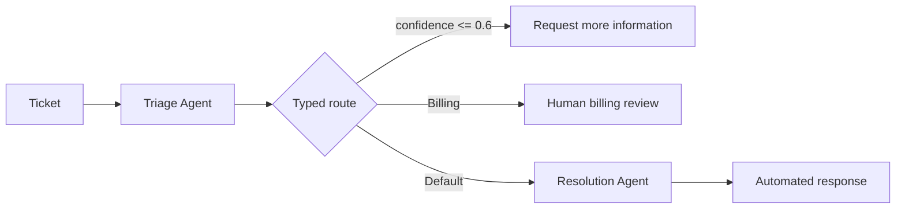

# Exercise 5a (Optional): สร้าง routing workflow ด้วย Microsoft Agent Framework

หลังจากสร้าง visual workflow ใน Exercise 5 แล้ว เราจะประกอบ logic เดิมเป็น code-first graph เพื่อดูแนวทางที่ Microsoft แนะนำสำหรับ workflow ใหม่ โดยยังใช้ ticket, Foundry project และ model deployment ชุดเดิม

> **⚠️ note:** Microsoft ประกาศยุติ Foundry visual workflow designer และ in-portal workflow execution วันที่ **1 ธันวาคม 2026** และแนะนำ Microsoft Agent Framework สำหรับ workflow ใหม่ Exercise 5 ยังคงเป็น common flow ของ workshop ส่วน Exercise 5a แสดง migration path แบบ code-first ดู [official workflow and migration guidance](https://learn.microsoft.com/azure/foundry/agents/concepts/workflow#migration-guide)

## Prerequisites

- ทำ Exercise 5 เสร็จ หรือเข้าใจ flow ของ ticket triage เดิม
- ทำ Exercise 2 เสร็จและมี `FOUNDRY_PROJECT_ENDPOINT` กับ `FOUNDRY_MODEL` ใน `.env`
- ลงชื่อเข้าใช้ Azure CLI แล้วด้วย `az login --use-device-code`
- ใช้ไฟล์ [service-tickets.json](../05-build-foundry-workflow/files/service-tickets.json) ชุดเดิม
- ติดตั้ง dependencies จาก `requirements.lock` แล้ว



---

## Practice 1: เปรียบเทียบ visual nodes กับ code-first graph

**Primary target:** ระบุได้ว่า node จาก Exercise 5 ย้ายมาเป็น data model, executor, edge และ Python loop ส่วนใด

1. เปิด `service_ops/framework_workflow.py`
2. เปรียบเทียบส่วนประกอบกับ visual workflow เดิม:

   | Exercise 5 visual workflow | Exercise 5a Agent Framework |
   |---|---|
   | `Set variable` และ `For each` | `load_tickets()` และ loop ใน `run_framework_workflow()` |
   | Triage Agent พร้อม JSON Schema | `TriageResponse` และ `AgentExecutor` |
   | Power Fx `If/Else` | `Case`, `Default` และ routing predicate |
   | Resolution Agent | Resolution `AgentExecutor` |
   | Preview diagram | `WorkflowViz(...).to_mermaid()` |

3. สังเกตว่า `TriageResponse` จำกัด `category` ให้เป็น `Billing`, `Technical` หรือ `General` และจำกัด `confidence` ให้อยู่ระหว่าง 0 ถึง 1
4. อ่าน `needs_more_information()` และ `needs_billing_review()` แล้วตรวจลำดับที่ต้องการ:
   - confidence ไม่เกิน `0.6` ต้องขอข้อมูลเพิ่มก่อน แม้ category เป็น Billing
   - Billing ที่ confidence มากกว่า `0.6` จึงส่งให้คนตรวจ
   - กรณีที่เหลือไป Resolution Agent
5. รัน baseline เดิมที่ไม่ใช้ Azure quota:

   ```bash
   python -m service_ops workflow --mode local
   ```

6. บันทึก route ที่คาดไว้:
   - `SR-1001` → `automated-response`
   - `SR-1002` → `human-escalation`
   - `SR-1003` → `request-more-information`

### Checkpoint

- อธิบาย mapping จาก visual node ไปยัง Agent Framework component ได้
- ยืนยันว่า structured response ถูก validate ก่อนใช้ตัดสินใจ route
- baseline แสดง route ครบสามแบบ

---

## Practice 2: ประกอบ Agent Framework routing graph

**Primary target:** สร้าง Triage Agent, Resolution Agent และ ordered switch-case graph สำหรับ ticket หนึ่งรายการ

1. ใน `service_ops/framework_workflow.py` หา `TODO Exercise 5a` ภายใน `build_ticket_workflow()`
2. แทน TODO และ `raise NotImplementedError(...)` ด้วยโค้ดนี้:

   ```python
   credential = credential_factory()
   client = client_factory(
       project_endpoint=settings.foundry_project_endpoint,
       model=settings.foundry_model,
       credential=credential,
   )
   triage_agent = agent_executor_factory(
       client.as_agent(
           name="fabrikam-triage-agent",
           instructions=TRIAGE_INSTRUCTIONS,
           default_options={"response_format": TriageResponse},
       ),
       id="triage_agent",
   )
   resolution_agent = agent_executor_factory(
       client.as_agent(
           name="fabrikam-resolution-agent",
           instructions=RESOLUTION_INSTRUCTIONS,
           default_options={"response_format": ResolutionResponse},
       ),
       id="resolution_agent",
   )
   return (
       builder_factory(
           start_executor=prepare_ticket,
           output_from=[
               request_more_information,
               request_billing_review,
               finalize_automated_response,
           ],
           name="fabrikam-service-ticket-routing",
       )
       .add_edge(prepare_ticket, triage_agent)
       .add_edge(triage_agent, parse_triage_response)
       .add_switch_case_edge_group(
           parse_triage_response,
           [
               Case(
                   condition=needs_more_information,
                   target=request_more_information,
               ),
               Case(
                   condition=needs_billing_review,
                   target=request_billing_review,
               ),
               Default(target=prepare_resolution_request),
           ],
       )
       .add_edge(prepare_resolution_request, resolution_agent)
       .add_edge(resolution_agent, finalize_automated_response)
       .build()
   )
   ```

3. ตรวจว่า low-confidence `Case` อยู่ก่อน Billing `Case` เพราะ Agent Framework ประเมิน ordered cases ตามลำดับและหยุดที่ case แรกที่ตรง
4. ตรวจว่า `Default` เป็นเส้นทางเดียวที่เรียก Resolution Agent
5. ตรวจว่า `output_from` มี terminal executor ครบสามเส้นทาง
6. บันทึกไฟล์

### Checkpoint

- Graph เริ่มที่ `prepare_ticket` และเรียก Triage Agent ก่อนตัดสินใจ
- Switch-case มี low confidence, Billing และ default route ตามลำดับ
- เฉพาะ default route เชื่อมต่อไปยัง Resolution Agent

---

## Practice 3: สร้าง diagram และรัน ticket ทั้งสาม

**Primary target:** ตรวจ topology จาก Mermaid แล้วเปรียบเทียบ framework routes กับ baseline เดิม

1. สร้าง Mermaid diagram โดยไม่เรียก model:

   ```bash
   python -m service_ops workflow-framework --diagram
   ```

2. ตรวจว่า diagram มี Triage Agent, switch routes, Resolution Agent และ terminal output ครบสามแบบ
3. รัน code-first workflow กับ ticket ทั้งสาม:

   ```bash
   python -m service_ops workflow-framework
   ```

4. ตรวจว่า output มีผลหนึ่งรายการต่อ ticket และ route ที่คาดไว้ครบสามแบบ
5. รัน baseline อีกครั้ง:

   ```bash
   python -m service_ops workflow --mode local
   ```

6. เปรียบเทียบ `ticket_id`, `category`, `confidence` และ `route` ถ้า route ต่างจาก baseline ให้ตรวจ:
   - Triage instructions และ `response_format`
   - ลำดับ `Case` ใน switch-case group
   - confidence threshold ที่ `0.6`
7. อย่าเปรียบเทียบ recommendation แบบคำต่อคำ เพราะข้อความจาก model เปลี่ยนได้ แต่ต้องไม่ขอ credential, อ้างว่าแก้ระบบแล้ว หรือสัญญาคืนเงิน

### Checkpoint

- Mermaid แสดง topology จาก code โดยไม่ต้องใช้ visual workflow designer
- Framework workflow คืนหนึ่งผลต่อ ticket
- Route โดยรวมตรงกับ baseline: `automated-response`, `human-escalation` และ `request-more-information`

> **💡 Scope:** คำว่า human review ใน Exercise นี้เป็นเพียง route result ไม่มีการสร้าง approval, incident, email หรือ ticket ภายนอก และการรัน graph ใน Codespace ยังเรียก Foundry model จากระยะไกล จึงอาจใช้ quota

---

## Summary

เราได้ย้ายแนวคิดจาก visual workflow มาเป็น Agent Framework graph ที่มี typed response, executor, ordered routing และ Mermaid visualization โดยไม่เปลี่ยน common flow ของ workshop ขั้นต่อไปให้ทำ Exercise 6 เพื่อเพิ่ม simulated function tool ให้ code-first Agent

## Official references

- [Foundry workflow migration guide](https://learn.microsoft.com/azure/foundry/agents/concepts/workflow#migration-guide)
- [Agent Framework workflow concepts](https://learn.microsoft.com/agent-framework/concepts/workflows/)
- [Agents in workflows](https://learn.microsoft.com/agent-framework/workflows/agents-in-workflows)
- [Switch-case edges](https://learn.microsoft.com/agent-framework/concepts/workflows/edges#switch-case-edges)
- [Workflow visualization](https://learn.microsoft.com/agent-framework/workflows/visualization)