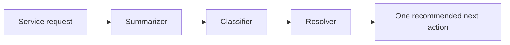

# Exercise 7: สร้าง multi-agent solution

Fabrikam ต้องการแยกงานในระบบที่ตรวจสอบได้เป็นให้ถูกจัดการเป็น 3 ส่วน: Summarizer สำหรับการสรุป, Classifier สำหรับแยกประเภท และ Resolver สำหรับการเสนอวิธีการแก้ปัญหา เราจะใช้ Agent Framework `SequentialBuilder` ส่งข้อความ prompt เดียวผ่าน Agent ทั้ง 3 ตามลำดับ


## Prerequisites

- ติดตั้ง dependency จาก `requirements.lock` แล้ว รวม `agent-framework-orchestrations==1.0.2`
- มีไฟล์ [customer-feedback.json](./files/customer-feedback.json)
- ทำ Exercise 6 เสร็จและเข้าใจว่า tool ที่ใช้ระหว่างเรียนเป็น simulation



---

## Practice 1: ประกอบ sequential orchestration

**Primary target:** สร้าง workflow ที่รัน Summarizer → Classifier → Resolver และส่งบริบทต่อกันตามลำดับ

1. เปิด `service_ops/multi_agent.py` แล้วอ่าน instructions ของ Agent ทั้งสาม
2. แทนส่วน `TODO Exercise 7` ใน `build_multi_agent_workflow()` ด้วย:

   ```python
   credential = credential_factory()
   chat_client = client_factory(
       project_endpoint=settings.foundry_project_endpoint,
       model=settings.foundry_model,
       credential=credential,
   )
   summarizer = chat_client.as_agent(
       name="summarizer",
       instructions=SUMMARIZER_INSTRUCTIONS,
   )
   classifier = chat_client.as_agent(
       name="classifier",
       instructions=CLASSIFIER_INSTRUCTIONS,
   )
   resolver = chat_client.as_agent(
       name="resolver",
       instructions=RESOLVER_INSTRUCTIONS,
   )
   return builder_factory(
       participants=[summarizer, classifier, resolver],
       output_from="all",
   ).build()
   ```

3. บันทึกไฟล์ แล้วรัน feedback แรก:

   ```bash
   python -m service_ops multi-agent --feedback "FB-3001: The portal is clear, but the dashboard timed out twice while I reviewed service metrics."
   ```

4. ตรวจว่า final output มาจาก Resolver และเสนอการจัดการ Technical 

### Checkpoint

- Sequential workflow สร้าง Agent ครบสามตัวตามลำดับ และ Resolver ได้แนะนำ next action หนึ่งรายการ

---

## Summary

เราได้ cumulative Fabrikam Service Operations solution ที่ใช้ code-owned Agent, MCP, Foundry IQ, visual/local workflow, simulated tool และ Agent Framework orchestration ต่อเนื่องใน project และ codebase เดียว

ก่อนจบวัน ให้ทำ cleanup ตามผู้สอนกำหนด ห้ามลบ resource group จนกว่าจะได้รับการยืนยันว่าไม่มีผู้เรียนหรือขั้นตอนอื่นใช้งานอยู่
